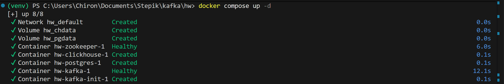
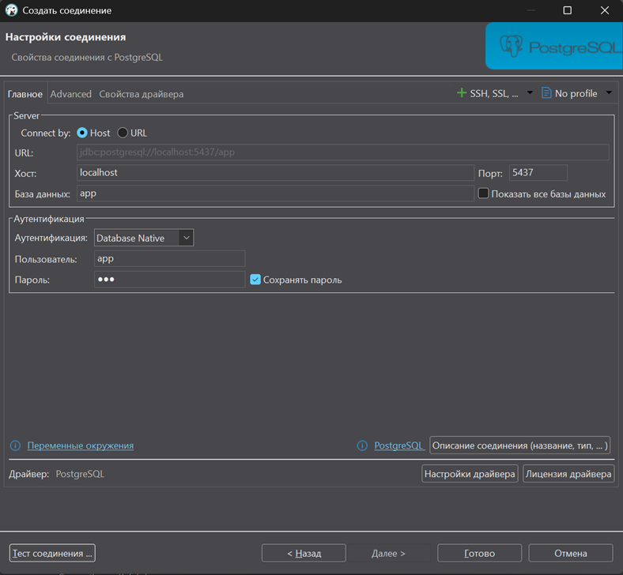
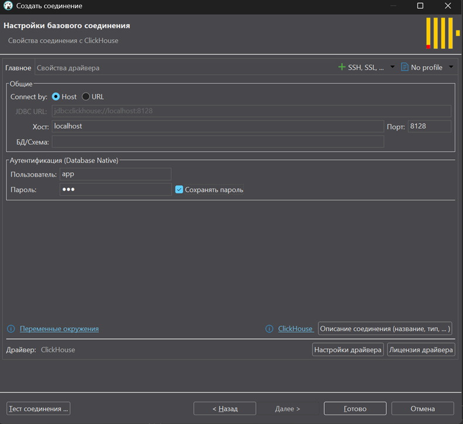
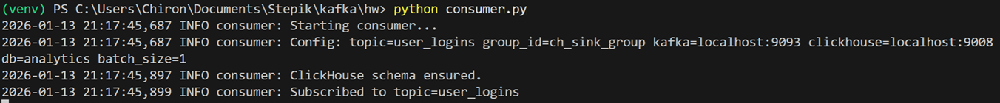
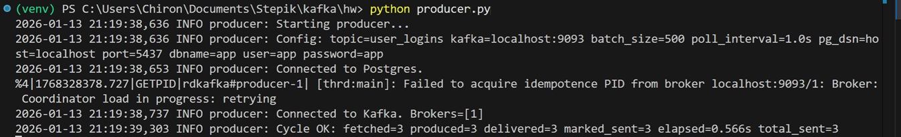
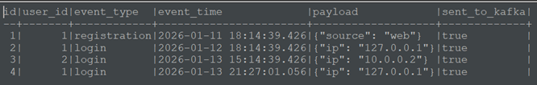
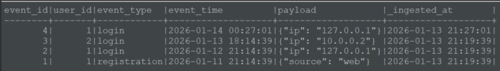
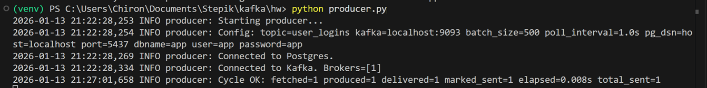
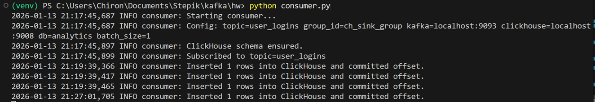

# PostgreSQL → Apache Kafka → ClickHouse (без дубликатов)

## Описание

Данный проект реализует устойчивый пайплайн для переноса событий пользователей из базы данных PostgreSQL в аналитическую базу ClickHouse с использованием Apache Kafka в качестве промежуточного транспортного слоя.

В таблице PostgreSQL `user_logins` используется дополнительное логическое поле:

```sql
sent_to_kafka BOOLEAN NOT NULL DEFAULT FALSE
```

Данное поле служит маркером того, были ли данные уже отправлены в Apache Kafka, и позволяет избежать повторной отправки уже обработанных записей.

## Логика работы пайплайна

1. Продюсер (producer.py) читает из таблицы PostgreSQL `user_logins` только записи, у которых значение поля `sent_to_kafka` равно FALSE.
2. После успешной доставки сообщений в Apache Kafka продюсер обновляет соответствующие записи в PostgreSQL, устанавливая значение `sent_to_kafka = TRUE`.
3. Консьюмер (consumer.py) читает сообщения из Apache Kafka и вставляет их в таблицу ClickHouse.
4. Смещения (offset) Apache Kafka коммитятся только после успешной вставки данных в ClickHouse.

Таким образом, пайплайн обеспечивает устойчивую передачу данных и защиту от повторной отправки сообщений на уровне источника данных.

## Компоненты системы

- PostgreSQL — источник событий пользователей
- Apache Kafka — транспортный слой для передачи сообщений
- ClickHouse — аналитическая база данных для хранения событий
- `producer.py` — продюсер (PostgreSQL → Apache Kafka)
- `consumer.py` — консьюмер (Apache Kafka → ClickHouse)
- `postgres_init.sql` — sql скрипт для создания таблицы `user_logins` с тестовыми данными (PostgreSQL)
- `clickhouse_init.sql` — sql скрипт для создания таблицы `user_logins` для хранения событий (ClickHouse)

## Подготовка Python-окружения

Для работы проекта используются сторонние Python-библиотеки, такие как `psycopg2`, `confluent-kafka` и `clickhouse-driver`. При использовании Python версии 3.12 возможны ошибки установки и импорта этих библиотек в глобальном окружении.

## Запуск инфраструктуры

Все необходимые сервисы (PostgreSQL, Apache Kafka и ClickHouse) запускаются с помощью Docker Compose.

```bash
docker compose up -d
```


## Подключение в DBeaver
*подключение к PosgreSQL (пароль `app`):*



*подключение к Clickhouse (пароль `app`):*



## Создание виртуального окружения

```bash
python -m venv venv
```

## Активация виртуального окружения (Windows)

```bash
venv\Scripts\activate
```

<details>
<summary><strong>NB!</strong> Важное примечание</summary>
Пример ошибки при запуске `.py` файлов без виртуального окружения при уставноленной версии python выше 3.10:

Traceback (most recent call last):
  File "producer.py", line 6, in <module>
    import psycopg2
ModuleNotFoundError: No module named 'psycopg2'

Для изоляции зависимостей и предотвращения подобных ошибок рекомендуется использовать виртуальное окружение Python (venv).
</details>

## Запуск пайплайна

Рекомендуемый порядок запуска компонентов пайплайна:

1. Запуск консьюмера (чтение из Kafka и запись в ClickHouse):

```bash
python consumer.py
```



2. Запуск продюсера (чтение из PostgreSQL и отправка сообщений в Kafka):

```bash
python producer.py
```



## Проверка корректности работы

### Проверка Postgres на отсутствие неотправленных строк

```sql
SELECT count(*) AS unsent
FROM user_logins
WHERE sent_to_kafka = FALSE;
```
*ожидаемый ввывод:*

```text
unsent|
------+
     0|
```

### Добавление тестовой записи в PostgreSQL

```sql
INSERT INTO user_logins (user_id, event_type, event_time, payload, sent_to_kafka)
VALUES (1, 'login', now(), '{"ip": "127.0.0.1"}', FALSE);
```



### Проверка выставления флага `sent_to_kafka`

```sql
SELECT id, sent_to_kafka
FROM user_logins
ORDER BY id DESC
LIMIT 5;
```

*ожидаемый вывод:*
```text
id|sent_to_kafka|
--+-------------+
 4|true         |
 3|true         |
 2|true         |
 1|true         |
```

Ожидаемый результат: добавленная запись имеет значение `sent_to_kafka = TRUE`.

### Проверка наличия данных в ClickHouse

```sql
SELECT *
FROM analytics.user_logins
ORDER BY _ingested_at DESC
LIMIT 5;
```



Ожидаемый результат: новая запись login (последняя в таблице) присутствует в таблице ClickHouse.

### Проверка состояния `producer.py`



### Проверка состояния `consumer.py`



## Гарантии и ограничения решения

- Защита от повторной отправки данных реализована с помощью логического поля `sent_to_kafka` в PostgreSQL.
- Продюсер отправляет каждую запись не более одного раза в штатном режиме работы.
- Консьюмер коммитит смещения Apache Kafka только после успешной вставки данных в ClickHouse.
- Решение реализует семантику at-least-once и предназначено для задач миграции и аналитической обработки данных.

## Итог

В результате реализован пайплайн передачи данных: PostgreSQL → Apache Kafka → ClickHouse